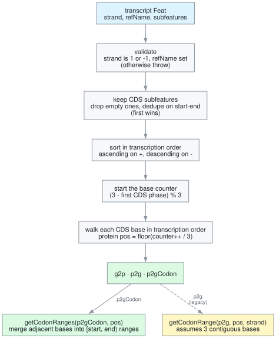

# How the mapping works

`genomeToTranscriptSeqMapping` walks a transcript's CDS bases in transcription
order and numbers them in groups of three.

The graph source is [`img/mapping.dot`](img/mapping.dot); regenerate with
`dot -Tsvg docs/img/mapping.dot -o docs/img/mapping.svg`.

## Steps

1. **Validate.** The parent needs `strand` of `1` or `-1` and a `refName`, or
   the function throws.
2. **Collect CDS.** Only `subfeatures` with `type === 'CDS'` and `start < end`
   count. GFF3 files can repeat CDS rows, so the first one for each `start-end`
   pair wins.
3. **Sort.** Ascending by `start` on the forward strand, descending on the
   reverse strand.
4. **Seed the counter.** `(3 - phase) % 3`, where `phase` comes from the first
   CDS only. Phase is the number of bases at the start of that CDS that complete
   a codon begun outside this transcript.
5. **Walk the bases.** Each base gets protein position `floor(counter / 3)`. The
   function assumes the per-segment phases agree with running the counter
   through every base.

## Reverse strand

Bases are visited from `end - 1` down to `start`, so `p2gCodon` lists genome
positions in transcription order, which is descending. For a reverse-strand CDS
`[0, 6)` the codons become `{ 0: [5, 4, 3], 1: [2, 1, 0] }`, and `p2g` holds the
highest coordinate of each codon.

## Codons that split

A codon splits across an exon boundary, or at the start of a CDS with
`phase != 0`. Its bases are then not contiguous in the genome.

- `p2gCodon` holds all three positions, so nothing is lost.
- `getCodonRanges` sorts them and merges adjacent bases, returning one range per
  contiguous piece.
- `getCodonRange` assumes three contiguous bases and returns a range that
  includes intronic or out-of-CDS positions for a split codon. It stays for
  backwards compatibility.

## Assumptions

- Translation is simple 3-letter codons. Selenocysteine recoding, ribosomal
  frameshifts and similar exceptions are not modelled; validate against your own
  data.
- All coordinates are 0-based and half-open.
